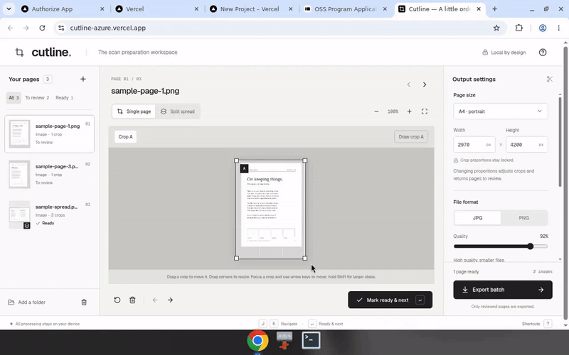

# cutline.

**The scan preparation workspace.** A browser cropper for photos and PDFs. Local by design — processing stays on your device.

[Open the live demo →](https://cutline-azure.vercel.app)

## Demo



Prefer video? [Watch docs/demo.mp4](docs/demo.mp4).

## What it does

Drop scans on the landing page, or **try a sample batch** without bringing your own files.

- Crop a **single page**, or **split a spread** into Crop A and Crop B
- Drag a crop to move it, drag corners to resize, arrow keys for fine steps
- **Mark ready & next** through the queue (`Enter`). `J` / `K` to navigate
- Output presets: A4, US Letter, square — or custom pixels. Crop proportions stay locked
- **JPG** or **PNG**, with a quality slider
- Export reviewed pages as a **ZIP**, or save directly to a folder for large batches

Only pages you marked ready are exported. Originals are never changed. Close the tab and the session is gone.

## Quick start

```bash
npm install
npm run dev
```

## Stack

React 19, Vite, TypeScript, [pdf.js](https://mozilla.github.io/pdf.js/), [fflate](https://github.com/101arrowz/fflate).

## License

[MIT](LICENSE)
